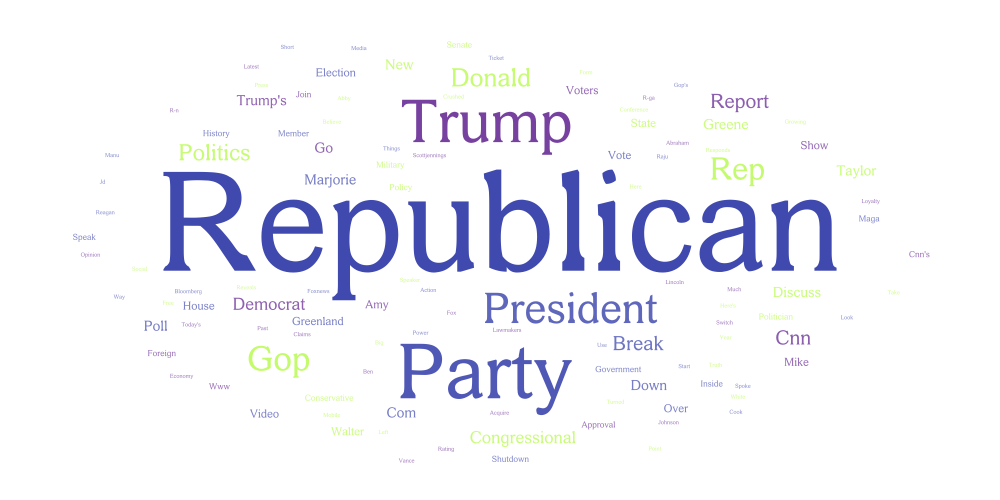
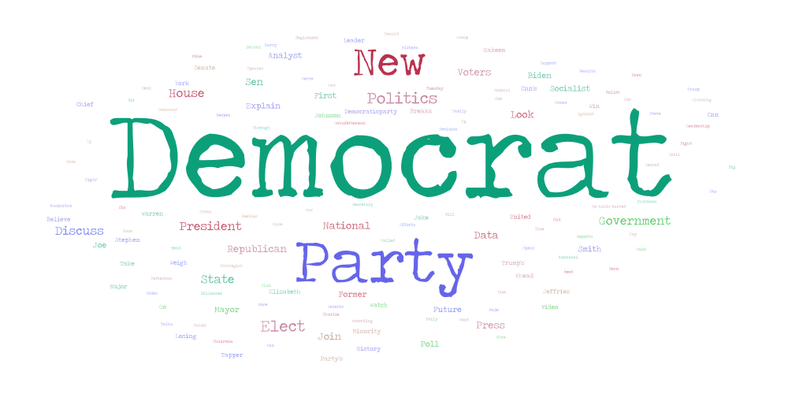
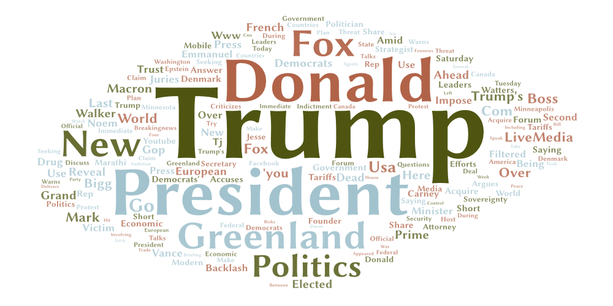

# Political Word Clouds

The topic I choose to scrap was politics. In todays news, lots of buzzwords are used in news headlines. I decided to make a word cloud for each main politcal party in the United States. I was curious to see the diffrence in words used to describe each party. The three parameters I used were "democratic party", "republican party", and "politics"

Comparing the three word clouds shows that there are lots of overlapping words. The most prominent keyword between the three is "Trump". This makes sense as Donald Trump is the current sitting president and is on the news daily. Currently in the news is Trumps effort to buy Greenland and you can see this through how big the country is on the political word cloud. These word clouds represent the most current news and state of each political party. It makese sense that there are not many strong postive words associated with the Democratic party search right now. This topic can be improved by further adding in a current event to see how each party views it. For example search results about ICE will differ by adding each parties name to the search. I was surprised how little the democratic world cloud was in comparison to the republican word cloud.

## CSV Files
* [democrat.csv](assets/democrat.csv)
* [republican.csv](assets/republican.csv)
* [politics.csv](assets/politics.csv)
